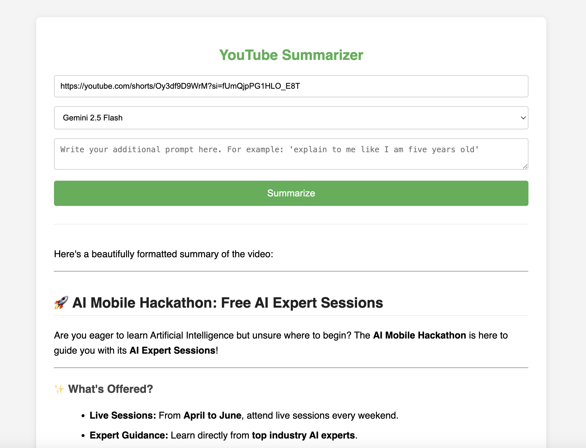

# 🎬 YouTube Summarizer using Gemini AI

A powerful web application that summarizes YouTube videos using Google Gemini AI.
Built with Flask and deployed on Google Cloud Run.

---

## 📸 App Screenshot



---

## Features

* Summarize YouTube videos instantly
* Powered by Google Gemini AI
* Custom prompt support (e.g., "Explain like I'm 5")
* Fast and serverless deployment
* Clean and responsive UI

---

## Tech Stack

* **Backend:** Flask (Python)
* **AI Model:** Google Gemini (Vertex AI)
* **Frontend:** HTML, CSS, JavaScript
* **Deployment:** Google Cloud Run

---

## How It Works

1. User enters a YouTube video link
2. The app sends the content to Gemini AI
3. Gemini generates a structured summary
4. Summary is displayed in the UI

---

## 📂 Project Structure

```
.
├── app.py
├── requirements.txt
└── templates/
    └── index.html
```

---

## ⚙️ Setup Locally

```
git clone https://github.com/anandgaur22/youtube-summarizer.git
cd youtube-summarizer

pip install -r requirements.txt
python app.py
```

---

## ☁️ Deployment (Google Cloud Run)

```
gcloud run deploy youtube-summarizer --source .
```

---

## ⚠️ Important Note

Direct YouTube URLs may not always work with `from_uri`.
For production-grade apps, consider using:

* YouTube Transcript API
* Video processing pipeline

---

## 📚 Reference

https://codelabs.developers.google.com/devsite/codelabs/build-youtube-summarizer

---

## 👨‍💻 Author

**Anand Gaur**
Mobile Tech Lead

---

## ⭐ Support

If you like this project, give it a ⭐ on GitHub!
